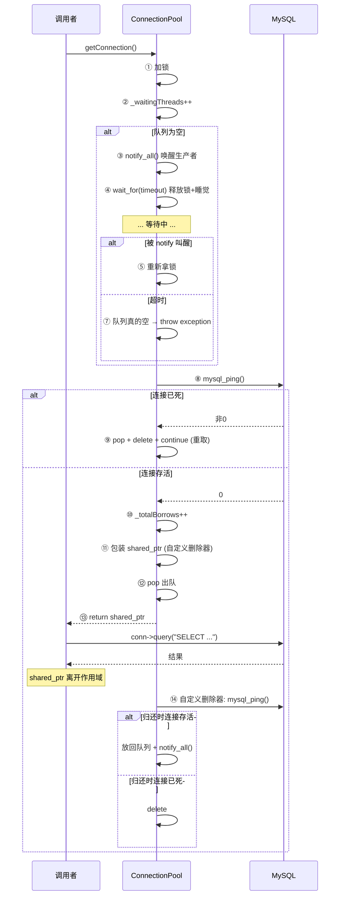
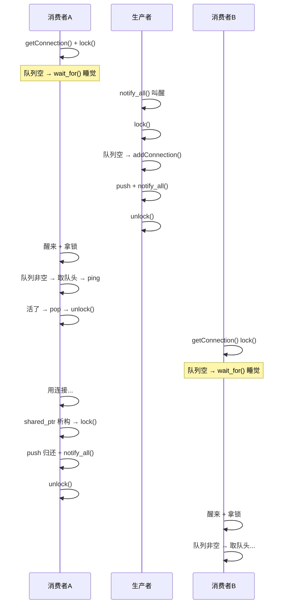

# getConnection() 深度解析

## 总览：一条连接从池子到调用者的完整旅程



---

## 逐行源码拆解

### 完整代码

```cpp
std::shared_ptr<Connection> ConnectionPool::getConnection() {
    std::unique_lock<std::mutex> lock(_queueMutex);
    _waitingThreads++;

    while (true) {
        while (_connectionQue.empty()) {
            _cv.notify_all();

            if (std::cv_status::timeout ==
                _cv.wait_for(lock, std::chrono::milliseconds(_connectionTimeout))) {
                if (_connectionQue.empty()) {
                    _totalTimeouts++;
                    _waitingThreads--;
                    throw std::runtime_error("Get connection timeout from pool");
                }
            }
        }

        Connection* front = _connectionQue.front();
        if (!front->isAlive()) {
            _connectionQue.pop();
            delete front;
            _connectionCnt--;
            continue;
        }

        _totalBorrows++;
        _waitingThreads--;

        std::shared_ptr<Connection> sp(front,
            [this](Connection* pcon) {
                std::unique_lock<std::mutex> lock(_queueMutex);
                if (!pcon->isAlive()) {
                    _connectionCnt--;
                    delete pcon;
                } else {
                    pcon->refreshAliveTime();
                    _connectionQue.push(pcon);
                    _cv.notify_all();
                }
            });

        _connectionQue.pop();
        return sp;
    }
}
```

---

### 第 1 行：函数签名

```cpp
std::shared_ptr<Connection> ConnectionPool::getConnection()
```

| 元素 | 含义 |
|------|------|
| `std::shared_ptr<Connection>` | 返回值类型——一个共享所有权的智能指针，指向 Connection 对象 |
| `ConnectionPool::` | 这是 ConnectionPool 类的成员函数 |

**为什么不返回 `Connection*` 裸指针？** 返回裸指针，调用者必须记住"用完归还"，一旦忘记、或中间抛异常跳过归还 → 连接永久泄漏。`shared_ptr` 让编译器自动担这个责。

---

### 第 2 行：加锁

```cpp
std::unique_lock<std::mutex> lock(_queueMutex);
```

| 元素 | 含义 |
|------|------|
| `std::unique_lock` | RAII 锁对象——离开作用域自动解锁，永远不用担心忘记 `unlock` |
| `std::mutex` | 互斥锁类型 |
| `_queueMutex` | ConnectionPool 的成员变量，保护 `_connectionQue` 队列 |

**为什么用 unique_lock 而不是 lock_guard？** 后面要用 `_cv.wait_for(lock, ...)`，条件变量只能配合 `unique_lock`。

---

### 第 3 行：监控埋点

```cpp
_waitingThreads++;
```

`_waitingThreads` 是 `std::atomic_long` 类型的原子变量。`++` 是原子操作（硬件级别的线程安全自增）。

**意义**：`getStats()` 调用者查 "现在有多少人在排队？" 时，就是读这个数。

---

### 第 4 行：外层死循环

```cpp
while (true) {
```

为什么套一层死循环？因为 **`continue` 的存在**。

```
取队头 → 死了 → continue → 回到这里 → 重新取下一个
```

---

### 第 5-14 行：等待队列非空

```cpp
while (_connectionQue.empty()) {           // ← while 不是 if！
    _cv.notify_all();                       // 喊生产者

    if (std::cv_status::timeout ==
        _cv.wait_for(lock, std::chrono::milliseconds(_connectionTimeout))) {
        if (_connectionQue.empty()) {
            _totalTimeouts++;
            _waitingThreads--;
            throw std::runtime_error("...");
        }
    }
}
```

#### 5.1 `while (_connectionQue.empty())` 为什么是 while 不是 if？

条件变量可能**虚假唤醒**——POSIX 允许操作系统无缘无故唤醒等待中的线程。如果被虚假唤醒：

```
if 版本： 醒了 → 条件不检查 → 继续执行 → 队列空的 → front() → UB
while 版本：醒了 → 检查条件 → 还是空的 → 继续 wait
```

while 保证醒后二重检查。

#### 5.2 `_cv.notify_all()`

在等待之前先喊一声："队列空了，生产者快起来建连接！"

去喊生产者：produceConnectionTask 里在 `_cv.wait(lock)` 睡大觉（"队列非空有货，我等它空"），被 notify 叫醒。

#### 5.3 `_cv.wait_for(lock, 时长)` 详解

```cpp
_cv.wait_for(lock, std::chrono::milliseconds(_connectionTimeout))
```

这行做四件事：

```
① 释放 _queueMutex 锁      ← 别人可以操作队列了
② 阻塞当前线程，睡觉         ← 不占 CPU
③ 等待两种情况之一醒来：
   ├── 被人 notify_all/notify_one 叫醒
   └── 等了时长毫秒，时间到了自己醒
④ 醒来重新获取 _queueMutex 锁  ← 重新拿到锁才能继续操作队列
```

**参数说明**：

| 参数 | 值 | 含义 |
|------|----|------|
| `lock` | unique_lock 对象 | wait 知道要释放/重拿哪把锁 |
| `std::chrono::milliseconds(_connectionTimeout)` | 例如 1000ms | 最多等这么久 |

`_connectionTimeout` 是 `int`（如 1000），`std::chrono::milliseconds(...)` 把整数 1000 转成 "1000 毫秒" 这个**时长概念**。

#### 5.4 `cv_status` 是什么

```cpp
std::cv_status::timeout
std::cv_status::no_timeout
```

`cv_status` 是一个内部枚举类，只有这两个取值。`wait_for` 的返回值：

| 返回值 | 谁产生的 | 含义 |
|--------|---------|------|
| `cv_status::no_timeout` | `notify_all/notify_one` | 被叫醒的——有货了 |
| `cv_status::timeout` | 操作系统 | 等够了时间，自己醒的——可能还没货 |

#### 5.5 为什么用 `==` 比较

跟 `if (x == 5)` 完全一样。`wait_for` 返回一个 `cv_status` 值，和常量比较：

```cpp
// 等价写法：
auto result = _cv.wait_for(lock, std::chrono::milliseconds(_connectionTimeout));
// result 要么是 cv_status::timeout，要么是 cv_status::no_timeout

if (result == std::cv_status::timeout) {
    // 超时了
}
```

#### 5.6 超时后为什么再检查一次队列

```cpp
if (std::cv_status::timeout == _cv.wait_for(...)) {
    if (_connectionQue.empty()) {   // ← 这个检查为什么需要？
```

**竞态窗口（Race Condition）**：

```
时刻 T1: wait_for 超时，返回 cv_status::timeout
时刻 T2: 就在这一纳秒，另一个线程归还了一个连接，push 到队列 + notify_all
         但 notify 已经来不及了——线程 T1 已经从 wait_for 返回了
时刻 T3: 当前线程检查队列 → 不空！（T2 归还的那个在里面）
```

如果不加 `if (_connectionQue.empty())` 二次检查，线程 T1 会在队列非空的情况下抛异常说"没连接"——这不对。

**所以这个检查是必需的**：防御 wait_for 超时和队列变化之间的那纳秒级窗口。

#### 5.7 确认超时：抛异常

```cpp
_totalTimeouts++;
_waitingThreads--;
throw std::runtime_error("Get connection timeout from pool");
```

- `_totalTimeouts++`：监控记一次超时
- `_waitingThreads--`：我不等了，退出排队
- `throw`：抛异常，调用者 catch 处理（连接池已经没办法了）

---

### 第 16-22 行：健康检查

```cpp
Connection* front = _connectionQue.front();
if (!front->isAlive()) {
    _connectionQue.pop();
    delete front;
    _connectionCnt--;
    continue;
}
```

#### 队头但不 pop？

`front()` 只查看不弹出。健康检查通过才构造 shared_ptr 然后 pop。

**如果先 pop 再构造 shared_ptr，构造过程中抛异常 → 连接已经从队列移除但没被管理 → 泄漏。**

#### `isAlive()` 做什么

```cpp
bool Connection::isAlive() {
    return mysql_ping(_conn) == 0;
}
```

向 MySQL 发一个最小探测包。连接在队列里可能闲置了 8 小时被服务端断开——这行能发现。

#### 死了怎么处理

- `pop()`：从队列移除
- `delete`：断开 MySQL 连接，释放内存
- `_connectionCnt--`：总数减一
- `continue`：跳回 `while(true)` 开头，重新取下一个队头

---

### 第 24-25 行：成功计数

```cpp
_totalBorrows++;
_waitingThreads--;
```

终于拿到活连接了。记一次成功借用，退出等待队列。

---

### 第 27-36 行：构造 shared_ptr 注入自定义删除器

```cpp
std::shared_ptr<Connection> sp(front,
    [this](Connection* pcon) {
        std::unique_lock<std::mutex> lock(_queueMutex);
        if (!pcon->isAlive()) {
            _connectionCnt--;
            delete pcon;
        } else {
            pcon->refreshAliveTime();
            _connectionQue.push(pcon);
            _cv.notify_all();
        }
    });
```

#### 普通 shared_ptr 的行为

```cpp
std::shared_ptr<Connection> sp(new Connection);
// sp 析构时 → delete 对象 → mysql_close → 连接没了
```

连接池的使命是**复用**，不能每次用完都销毁。

#### 自定义删除器的妙用

把析构行为从"销毁"替换为"归还"：

```
引用计数归零 → 不调 delete → 调 lambda → 连接放回队列
```

#### lambda 内部逻辑

```
归还时 ping 一下
├── 死了 → 真删（mysql_close + 释放内存 + _connectionCnt--）
│         （连接在借出期间 MySQL 重启了 / 网络断了）
└── 活着 → refreshAliveTime + push 队列 + notify_all
          （通知等待的消费者：有货了）
```

**双重检测**：借用时检查 + 归还时检查 = 死连接绝不放回队列。

---

### 第 38-39 行：出队和返回

```cpp
_connectionQue.pop();
return sp;
```

`pop()`：从队列正式移除，连接所有权已转交给 shared_ptr。

`return sp`：调用者拿到 shared_ptr，当成普通指针用即可。离开作用域自动触发归还。

---

## 关键设计决策问答

### Q1：为什么不先 pop 再构造 shared_ptr？

先 pop 后构造，如果构造过程中抛异常 → 连接已经从队列移除但没有任何东西管理它 → 永久泄漏。

先构造后 pop，构造失败不影响队列。

### Q2：为什么健康检查在锁内？

检查的是队列内容，当然在锁内。`mysql_ping` 在活连接上几乎是零开销（一次轻量 ping-pong），不会长时间持锁。

### Q3：那个 continue 会不会无限循环？

如果队列里全是死连接：一个一个清掉，直到队列空 → 回到等待循环 → 叫生产者创建新连接 → 生产者受到通知 → 创建新连接 → push → notify_all → 拿到活连接。

不会无限循环——因为有生产者兜底。

### Q4：调用者怎么用这个函数？

```cpp
try {
    auto conn = ConnectionPool::getConnectionPool()->getConnection();
    MYSQL_RES* res = conn->query("SELECT * FROM users");
    // 处理结果...
    mysql_free_result(res);
    // conn 离开作用域，自动归还连接
} catch (const std::runtime_error& e) {
    // 连接池没货了，等太久了
}
```

---

## 线程交互全景



---

## 涉及的知识点索引

| 知识点 | 出现位置 | 详见文档 |
|--------|---------|---------|
| `std::unique_lock` | 加锁 | `learning_notes_concurrency.md` §四.5 |
| `std::mutex` | _queueMutex | `learning_notes_concurrency.md` §四.3 |
| `std::condition_variable` | wait_for / notify_all | `learning_notes_concurrency.md` §四.6 |
| `std::cv_status` | timeout/no_timeout | 本文 §5.4 |
| `std::atomic_long` | _waitingThreads 等 | `learning_notes_concurrency.md` §四.7 |
| `std::shared_ptr` 自定义删除器 | sp 构造 | README §智能指针的妙用 |
| `mysql_ping` | isAlive() | `learning_notes_concurrency.md` §一.5 |
| `std::chrono::milliseconds` | 超时时长 | `learning_notes_concurrency.md` §二 |
| RAII | 锁 + shared_ptr | 本文 §关键设计决策 |
| 虚假唤醒 | while 不是 if | 本文 §5.1 |
